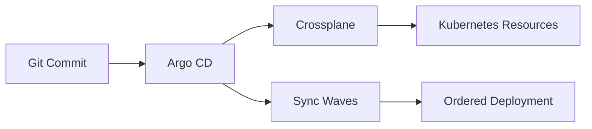

# 🚀 Building a GitOps Infrastructure Pipeline with Crossplane and Argo CD

*From manual kubectl commands to fully automated infrastructure management - here's how I built a production-ready GitOps pipeline*

---

## TL;DR
I built a complete GitOps infrastructure management system using:
- 🎯 **Argo CD** for GitOps automation
- ⚡ **Crossplane** for infrastructure provisioning
- 🔄 **App-of-Apps pattern** for scalable application management
- 📦 **MetalLB** as the infrastructure example
- 🎭 **Sync waves** for dependency management

**Result**: Infrastructure changes now happen through Git commits, with full automation and zero manual intervention.

---

## The Problem I Solved

Managing Kubernetes infrastructure traditionally sucks:
```bash
# The old way - manual and error-prone
kubectl apply -f metallb-config.yaml
kubectl apply -f ingress-controller.yaml
kubectl apply -f monitoring-stack.yaml
# Oh no! Order matters... 💥
# Which version is running in production? 🤷‍♂️
# Who made that change? 🕵️‍♂️
```

I wanted infrastructure that:
- ✅ Lives in Git (version controlled)
- ✅ Deploys automatically (no manual steps)
- ✅ Handles dependencies (no ordering issues)
- ✅ Self-heals (drift detection & correction)
- ✅ Provides audit trails (who, what, when)

---

## The Solution Architecture



## 🎯 Step 1: App-of-Apps Pattern

Instead of managing 50+ individual Argo CD applications, I use the **App-of-Apps pattern**:

```yaml
# One app to rule them all
apiVersion: argoproj.io/v1alpha1
kind: Application
metadata:
  name: homelab-root
  annotations:
    argocd.argoproj.io/sync-wave: "-1"
spec:
  source:
    repoURL: https://github.com/jamilshaikh07/homelab-gitops.git
    path: apps  # 👈 All child apps live here
  syncPolicy:
    automated:
      prune: true      # 🗑️ Clean up deleted resources
      selfHeal: true   # 🔧 Fix manual changes
```

**Benefits:**
- One root app manages everything
- New apps = just add YAML files
- Automatic discovery and deployment

---

## ⚡ Step 2: Crossplane for Infrastructure

Crossplane lets me manage infrastructure through Kubernetes APIs. Here's the magic:

```yaml
# Instead of direct kubectl apply...
apiVersion: kubernetes.crossplane.io/v1alpha1
kind: Object
metadata:
  name: metallb-ipaddresspool
  annotations:
    argocd.argoproj.io/sync-wave: "2"  # 👈 Depends on provider
spec:
  providerConfigRef:
    name: in-cluster
  forProvider:
    manifest:
      apiVersion: metallb.io/v1beta1
      kind: IPAddressPool
      metadata:
        name: homelab-pool
        namespace: metallb-system
      spec:
        addresses:
          - 10.20.0.81-10.20.0.99  # 🎯 My LoadBalancer IP range
```

**Why Crossplane Objects?**
- 🔄 **Continuous reconciliation** (drift detection)
- 📊 **Rich status reporting** (health, errors)
- 🎭 **Dependency management** (waits for providers)
- 🔒 **RBAC integration** (secure access)

---

## 🎭 Step 3: Sync Waves for Dependencies

Order matters in infrastructure! I use sync waves to ensure proper sequencing:

```yaml
# Wave -1: Root app-of-apps
argocd.argoproj.io/sync-wave: "-1"

# Wave 0: Install Crossplane providers
argocd.argoproj.io/sync-wave: "0"

# Wave 1: Provider configs + RBAC
argocd.argoproj.io/sync-wave: "1"

# Wave 2: Infrastructure resources
argocd.argoproj.io/sync-wave: "2"
```

**Result:** No more "CRD not found" or "provider not ready" errors! 🎉

---

## 🔐 Step 4: RBAC - The Critical Missing Piece

Crossplane needs permissions to manage your infrastructure. This is often overlooked:

```yaml
apiVersion: rbac.authorization.k8s.io/v1
kind: ClusterRole
metadata:
  name: crossplane-provider-kubernetes-metallb
rules:
- apiGroups: ["metallb.io"]
  resources: ["ipaddresspools", "l2advertisements"]
  verbs: ["*"]
---
# Bind to the provider's service account
apiVersion: rbac.authorization.k8s.io/v1
kind: ClusterRoleBinding
metadata:
  name: crossplane-provider-kubernetes-metallb
roleRef:
  kind: ClusterRole
  name: crossplane-provider-kubernetes-metallb
subjects:
- kind: ServiceAccount
  name: provider-kubernetes-xxxxx  # 👈 Get from kubectl
  namespace: crossplane-system
```

**Pro tip:** Restart provider pods after RBAC changes!

---

## 🧪 Testing the Complete Pipeline

Time for the moment of truth:

```bash
# 1. Bootstrap (one-time manual step)
kubectl apply -f argocd/app-of-apps.yaml

# 2. Check GitOps automation
kubectl -n argocd get applications
NAME                             SYNC STATUS   HEALTH STATUS
crossplane-provider-kubernetes   Synced        Healthy ✅
homelab-root                     Synced        Healthy ✅
metallb-config                   Synced        Healthy ✅

# 3. Verify infrastructure was created
kubectl -n metallb-system get ipaddresspools.metallb.io
NAME           ADDRESSES
homelab-pool   ["10.20.0.81-10.20.0.99"] ✅

# 4. Test LoadBalancer functionality
kubectl create deployment nginx --image=nginx
kubectl expose deployment nginx --type=LoadBalancer --port=80

kubectl get svc nginx
NAME    TYPE           EXTERNAL-IP   PORT(S)
nginx   LoadBalancer   10.20.0.82    80:30114/TCP ✅

# 5. Verify connectivity
curl http://10.20.0.82
<!DOCTYPE html>
<html>
<head><title>Welcome to nginx!</title></head>
# 🎉 SUCCESS!
```

**It works!** Infrastructure deployed entirely through GitOps! 🚀

---

## 📁 Repository Structure

```
homelab-gitops/
├── argocd/
│   └── app-of-apps.yaml              # 🏠 Root application
├── apps/
│   ├── crossplane-provider-kubernetes-app.yaml
│   └── metallb-config-app.yaml       # 👶 Child applications
├── crossplane/
│   └── provider-kubernetes/
│       ├── provider.yaml             # ⚡ Crossplane provider
│       ├── providerconfig.yaml       # ⚙️ Configuration
│       └── rbac.yaml                 # 🔐 Permissions
└── metallb/
    ├── metallb-ipaddresspool.yaml    # 🌐 Infrastructure
    └── metallb-l2advertisement.yaml  # 📦 Resources
```

---

## 💡 Key Lessons Learned

### 1. **API Versions Are Critical**
Different provider versions use different APIs:
```yaml
# v0.13.0 uses v1alpha1
apiVersion: kubernetes.crossplane.io/v1alpha1

# Newer versions use v1alpha2  
apiVersion: kubernetes.crossplane.io/v1alpha2
```

### 2. **Bootstrap is Still Manual**
Even with full GitOps, you need one manual step:
```bash
kubectl apply -f argocd/app-of-apps.yaml
```
After this, everything else is automated!

### 3. **RBAC Debugging**
If Crossplane objects stay "NotReady":
```bash
# Check provider permissions
kubectl -n crossplane-system describe object metallb-ipaddresspool

# Common fix: restart provider after RBAC changes
kubectl -n crossplane-system delete pod -l pkg.crossplane.io/provider=provider-kubernetes
```

### 4. **YAML Formatting Matters**
Watch your indentation! This kept my root app OutOfSync:
```yaml
# ❌ Wrong
destination:
  server: https://kubernetes.default.svc
namespace: crossplane-system

# ✅ Correct  
destination:
  server: https://kubernetes.default.svc
  namespace: crossplane-system
```

---

## 🚀 What's Next?

This foundation scales to manage ANY infrastructure:

```yaml
# Database clusters
kind: PostgreSQLCluster

# Service meshes  
kind: Istio

# Monitoring stacks
kind: PrometheusStack

# Certificate management
kind: ClusterIssuer

# Storage solutions
kind: StorageClass
```

**The pattern stays the same:**
1. Define in YAML
2. Commit to Git  
3. Argo CD syncs automatically
4. Crossplane provisions infrastructure
5. Profit! 💰

---

## 🎉 Results

**Before:**
- Manual `kubectl` commands
- Configuration drift
- No audit trail
- Deployment anxiety 😰

**After:**  
- Infrastructure as Code
- Git-driven deployments
- Automatic drift correction
- Pull request reviews
- Confidence in production 😎

**Infrastructure changes are now as simple as creating a pull request!**

---

## 🔗 Resources

- 📝 [Complete repository](https://github.com/jamilshaikh07/homelab-gitops)
- 📚 [Crossplane documentation](https://crossplane.io/)
- 🎯 [Argo CD documentation](https://argo-cd.readthedocs.io/)
- 🏗️ [App-of-Apps pattern](https://argo-cd.readthedocs.io/en/stable/operator-manual/cluster-bootstrapping/)

---

**What infrastructure will you GitOps next?** Drop a comment and let me know what you're planning to automate! 👇

---

*Follow me for more cloud-native and DevOps content! 🚀*

#GitOps #Kubernetes #Crossplane #ArgoCD #DevOps #Infrastructure #Automation #CloudNative #IaC #Homelab
